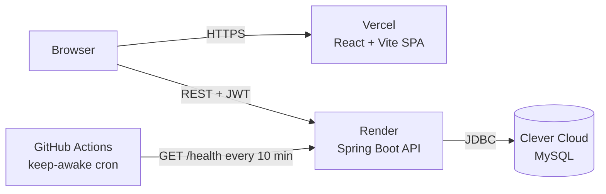
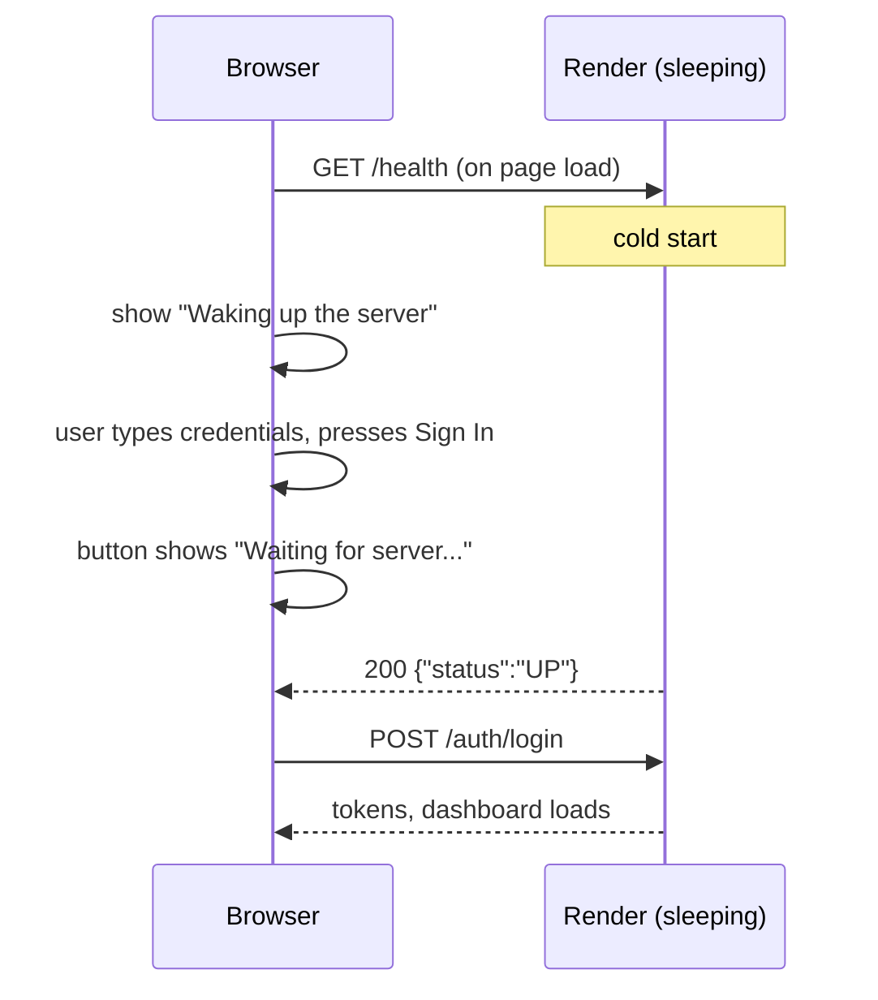

# Placement Management System

A full-stack campus placement platform: a **Spring Boot 3** REST API with JWT authentication and MySQL, and a **React + Vite** frontend. Students build a profile, see which openings they are eligible for, apply, and track their applications. Admins manage students, companies, and the whole application pipeline.

**Live demo:** [placement-system-five.vercel.app](https://placement-system-five.vercel.app) (frontend on Vercel, backend on Render, MySQL on Clever Cloud)

> The backend runs on Render's free plan, which sleeps when idle. Opening the site wakes it automatically: you will see a **"Waking up the server"** indicator for up to about a minute on the first visit, and you can fill in the login form meanwhile. See [Automatic backend wake-up](#automatic-backend-wake-up-render-free-tier).

---

## Contents

- [Features](#features)
- [Architecture](#architecture)
- [Tech stack](#tech-stack)
- [Quick start (local)](#quick-start-local)
- [Configuration](#configuration)
- [Automatic backend wake-up (Render free tier)](#automatic-backend-wake-up-render-free-tier)
- [Deployment](#deployment)
- [API reference](#api-reference)
- [Testing and CI](#testing-and-ci)
- [Troubleshooting](#troubleshooting)
- [Security notes](#security-notes)
- [Project structure](#project-structure)
- [Changelog: fixes and enhancements](#changelog-fixes-and-enhancements)

---

## Features

**Students**
- Register, sign in, and stay signed in (access token + rotating refresh token, refreshed automatically)
- Complete a profile (CGPA, skills, resume link) that unlocks applications
- Browse openings sorted by deadline, each labelled *You are eligible*, *Requires CGPA X*, *Deadline passed*, or *Already applied*
- Apply with one click and track application status

**Admins**
- Dashboard with totals for students, companies, applications, shortlisted, and selected
- Create, search (by skill, minimum CGPA), and delete students (the login account and applications are removed too)
- Post, edit, filter, and delete companies (their applications are removed too)
- Filter applications by company, status, and student email; move them through `APPLIED → SHORTLISTED → SELECTED / REJECTED`

**Interface**
- Tabbed navigation (*Opportunities / My applications / Profile* for students, *Overview / Students / Companies / Applications* for admins); the active tab is kept in the URL, so refresh and the back button work
- Admin overview with a pipeline breakdown, companies closing soon, applicant counts, and recent applications
- Instant search and filter chips, deadline countdowns, and an Applied → Shortlisted → Selected tracker for students
- Toast notifications, confirmation dialogs that say exactly what a delete removes, loading skeletons, and helpful empty states
- Works on phones (tables become stacked cards), follows the system dark mode, keyboard accessible, and respects reduced-motion settings
- Professional type system (Inter for text, Plus Jakarta Sans for headings, a single size/weight scale, tabular numbers) and a slate-and-indigo palette whose text colours meet WCAG AA contrast in both light and dark mode

**Platform**
- Server-side rules: a student can only apply with a complete profile, a CGPA at or above the company's cut-off, before the deadline, and only once
- Role-based authorization (`ADMIN`, `STUDENT`) with consistent JSON errors (`401`, `403`, `404`, `409`, `429`)
- First admin account created automatically from environment variables
- Per-client rate limiting, with a stricter limit on login/registration to slow down password guessing
- Health endpoints plus frontend and GitHub Actions logic that keep the free Render backend awake
- Swagger UI for exploring and testing the API

## Architecture



Every API response uses the same envelope:

```json
{ "success": true, "message": "Companies fetched successfully", "data": [ ... ] }
```

## Tech stack

| Layer | Technology |
| --- | --- |
| Backend | Java 17, Spring Boot 3.5, Spring Security, Spring Data JPA / Hibernate, Bean Validation |
| Auth | JWT (jjwt) access + refresh tokens, BCrypt password hashing |
| Database | MySQL 8 (H2 in-memory for tests) |
| Rate limiting | Bucket4j |
| API docs | springdoc-openapi / Swagger UI |
| Frontend | React 18, Vite 5 |
| Hosting | Vercel (frontend), Render (backend, Docker), Clever Cloud (MySQL) |
| Tooling | Docker, Docker Compose, GitHub Actions |

## Quick start (local)

### Option A: Docker Compose (everything in one command)

```bash
docker compose up --build
```

| Service | URL |
| --- | --- |
| Frontend | http://localhost |
| Backend | http://localhost:8080 |
| Swagger UI | http://localhost:8080/swagger-ui/index.html |
| MySQL | `localhost:3307` (user `root`, password `root`) |

A default admin is created on first start: **`admin@placement.local` / `ChangeMe123!`**. Override it with `APP_ADMIN_EMAIL` and `APP_ADMIN_PASSWORD` in a `.env` file next to `docker-compose.yml` (see [.env.example](.env.example)).

### Option B: Run backend and frontend separately

Prerequisites: Java 17+, Node.js 18+, and a MySQL database (`placement_db` on `localhost:3306` by default).

**Backend**

```bash
# macOS / Linux
APP_ADMIN_EMAIL=admin@placement.local APP_ADMIN_PASSWORD=ChangeMe123! ./mvnw spring-boot:run
```

```powershell
# Windows PowerShell
$env:APP_ADMIN_EMAIL="admin@placement.local"; $env:APP_ADMIN_PASSWORD="ChangeMe123!"
.\mvnw.cmd spring-boot:run
```

The API starts on http://localhost:8080 (Swagger UI at `/swagger-ui/index.html`, health check at `/health`).

**Frontend**

```bash
cd frontend
cp .env.example .env    # sets VITE_API_BASE_URL=http://localhost:8080
npm install
npm run dev
```

Open http://localhost:5173. Register a student account, or sign in with the admin account you configured.

## Configuration

All backend settings come from environment variables; defaults live in [`src/main/resources/application.yaml`](src/main/resources/application.yaml) and a complete template is in [`.env.example`](.env.example).

### Backend

| Variable | Default | Purpose |
| --- | --- | --- |
| `PORT` | `8080` | HTTP port. Render sets this automatically. |
| `SPRING_DATASOURCE_URL` | `jdbc:mysql://localhost:3306/placement_db` | JDBC URL (must start with `jdbc:mysql://`) |
| `SPRING_DATASOURCE_USERNAME` / `SPRING_DATASOURCE_PASSWORD` | `root` / `root` | Database credentials |
| `SPRING_JPA_HIBERNATE_DDL_AUTO` | `update` | Schema management |
| `SPRING_JPA_SHOW_SQL` | `false` | Log SQL statements |
| `SPRING_DATASOURCE_HIKARI_MAXIMUM_POOL_SIZE` | `5` | Connection pool size (use `2` on Clever Cloud's dev plan) |
| `JWT_SECRET` | development value | **Set in production.** At least 32 characters; the app refuses to start with a shorter one. |
| `JWT_EXPIRATION_MS` | `1800000` (30 min) | Access token lifetime |
| `JWT_REFRESH_EXPIRATION_MS` | `604800000` (7 days) | Refresh token lifetime |
| `APP_ADMIN_EMAIL` / `APP_ADMIN_PASSWORD` | empty | When both are set, an `ADMIN` account is created on startup if that email does not exist yet. Password must be 8+ characters. An existing account is never modified or promoted. |
| `APP_ADMIN_NAME` | `Placement Admin` | Display name for that admin |
| `APP_CORS_ALLOWED_ORIGINS` | localhost origins | Comma-separated frontend origins. Trailing slashes are ignored; patterns such as `https://*.vercel.app` are supported. |
| `RATE_LIMIT_CAPACITY` / `RATE_LIMIT_REFILL_TOKENS` / `RATE_LIMIT_REFILL_DURATION_MINUTES` | `100` / `100` / `1` | General API limit per client IP |
| `RATE_LIMIT_AUTH_CAPACITY` | `20` | Per-minute limit for `/auth/**` per client IP |
| `JAVA_OPTS` | tuned for small containers | JVM flags used by the Docker image |

### Frontend

| Variable | Purpose |
| --- | --- |
| `VITE_API_BASE_URL` | Backend base URL without a trailing slash, e.g. `https://placement-system-backend.onrender.com`. Baked in at build time, so redeploy the frontend after changing it. |

## Automatic backend wake-up (Render free tier)

**The problem.** Render's free web services [spin down after 15 minutes without traffic](https://render.com/docs/free#spinning-down-on-idle). Previously the site did nothing until someone pressed *Sign In*; that request then hung during the cold start, or failed with a confusing CORS/network error. The backend also had no public endpoint Render (or anything else) could use to check it or wake it.

**What happens now**, in three layers:

1. **When the link is opened.** The frontend pings `GET /health` immediately on page load, before React even renders ([`frontend/src/main.jsx`](frontend/src/main.jsx), [`frontend/src/api.js`](frontend/src/api.js)). The login panel shows a live status (*Connecting* → *Waking up the server (23s)* → *Server online*). If the user presses *Sign In* while the server is still starting, the button shows *Waiting for server...* and the login is sent as soon as the backend answers. No refresh or retry is needed.
2. **While the site is in use.** Every API call waits for the backend to be awake. If the backend drops mid-session, the status pill in the top bar turns amber, and data-loading requests retry automatically once it is back. The page also pings `/health` whenever the tab has been idle for 10 minutes so Render does not put the service to sleep during an active session.
3. **Between visits (optional, zero-config).** The [`Keep Render backend awake`](.github/workflows/keep-backend-awake.yml) GitHub Actions workflow pings `/health` every 10 minutes so visitors rarely hit a cold start at all. It finds the backend URL by itself: it reads the repository's *Website* field (currently the Vercel URL), downloads the deployed JavaScript bundle, and extracts the `*.onrender.com` address. To set it explicitly, add a repository variable `BACKEND_URL` (*Settings → Secrets and variables → Actions → Variables*).



Notes on the keep-awake workflow:
- Scheduled workflows only run from the default branch (`master`), so it starts working once merged. You can also run it manually from the *Actions* tab.
- Render's free plan includes 750 instance hours per workspace per month, enough to keep **one** service awake around the clock. Keeping several free services awake exceeds that. To stop, disable the workflow in the *Actions* tab.
- GitHub may delay scheduled runs at busy times and pauses scheduled workflows in repositories with no activity for 60 days; re-enable it from the *Actions* tab if that happens. An external monitor such as UptimeRobot or cron-job.org pointed at `/health` works as an alternative.
- A run fails (and GitHub emails you) if the backend does not respond after about 1.5 minutes of retries, so it also acts as a simple uptime alert.

**Faster cold starts.** The Docker image runs the JVM with `-XX:TieredStopAtLevel=1 -XX:+UseSerialGC -XX:MaxRAMPercentage=75`, which shortens startup on Render's small shared-CPU instance. The app binds to Render's `PORT` directly, and `/health` never touches the database, so Render's health check passes as soon as the app is up.

## Deployment

### 1. Database: Clever Cloud MySQL

1. Create a MySQL add-on in Clever Cloud and copy the host, port, database name, user, and password.
2. Convert them to JDBC form. Do not use the raw `mysql://...` URI.

```text
SPRING_DATASOURCE_URL=jdbc:mysql://HOST:3306/DATABASE_NAME
SPRING_DATASOURCE_USERNAME=USER
SPRING_DATASOURCE_PASSWORD=PASSWORD
```

The dev plan allows only **5 concurrent connections** (`max_user_connections = 5`), so keep the pool small (the Render Blueprint already does):

```text
SPRING_DATASOURCE_HIKARI_MAXIMUM_POOL_SIZE=2
SPRING_DATASOURCE_HIKARI_MINIMUM_IDLE=0
SPRING_DATASOURCE_HIKARI_IDLE_TIMEOUT=10000
SPRING_DATASOURCE_HIKARI_MAX_LIFETIME=30000
```

### 2. Backend: Render

**With the Blueprint (recommended).** In Render choose *New → Blueprint* and select this repository. [`render.yaml`](render.yaml) creates a Docker web service with:
- health check path `/health`
- a randomly generated `JWT_SECRET`
- the small connection pool above and cold-start JVM flags

Render prompts for the values it cannot know: `SPRING_DATASOURCE_URL`, `SPRING_DATASOURCE_USERNAME`, `SPRING_DATASOURCE_PASSWORD`, `APP_CORS_ALLOWED_ORIGINS` (your Vercel URL), `APP_ADMIN_EMAIL`, and `APP_ADMIN_PASSWORD`.

**Existing or manually created service.** Use runtime *Docker*, then:
- set *Settings → Health Check Path* to `/health`
- add the environment variables listed in [Configuration](#configuration), including `APP_ADMIN_EMAIL` and `APP_ADMIN_PASSWORD` to get an admin account
- set `JWT_SECRET` to a long random value (`openssl rand -base64 48`)

After deploying, open `https://<your-service>.onrender.com/health` (should return `"status":"UP"`) and `/health/ready` (also checks the database).

### 3. Frontend: Vercel

| Setting | Value |
| --- | --- |
| Framework preset | Vite |
| Root directory | `frontend` |
| Build command | `npm run build` |
| Output directory | `dist` |
| Environment variable | `VITE_API_BASE_URL=https://<your-service>.onrender.com` |

SPA rewrites, long-lived caching for hashed assets, and basic security headers are configured in [`frontend/vercel.json`](frontend/vercel.json).

Then add the Vercel URL to the backend's `APP_CORS_ALLOWED_ORIGINS`, for example:

```text
APP_CORS_ALLOWED_ORIGINS=https://placement-system-five.vercel.app,http://localhost:5173
```

### Post-deployment checklist

1. `GET /health` returns `UP`; `GET /health/ready` shows `"database":"UP"`.
2. Swagger UI loads at `/swagger-ui/index.html`, and *Try it out* works over HTTPS.
3. Open the Vercel site: the status indicator reaches *Server online*.
4. Sign in with the admin from `APP_ADMIN_EMAIL`, post a company.
5. Register a student, complete the profile, and apply.
6. As admin, shortlist the application; the student sees the new status.

## API reference

Interactive documentation: `/swagger-ui/index.html`. Authenticated endpoints expect `Authorization: Bearer <access token>`.

| Method | Path | Access | Description |
| --- | --- | --- | --- |
| GET | `/`, `/health` | Public | Service info and liveness (no database access) |
| GET | `/health/ready` | Public | Readiness, including a database check (`503` if unreachable) |
| POST | `/auth/register` | Public | Register a student account |
| POST | `/auth/login` | Public | Returns `token`, `refreshToken`, `expiresInMs` |
| POST | `/auth/refresh` | Public | Exchange a refresh token for new tokens |
| GET / PUT | `/students/me` | Student | Read / update own profile |
| GET | `/companies?role=` | Authenticated | List companies (soonest deadline first), optional role filter |
| GET | `/companies/{id}` | Authenticated | Company details |
| POST | `/applications/apply/{companyId}` | Student | Apply (checks profile, CGPA cut-off, deadline, duplicates) |
| GET | `/applications/my` | Student | Own applications, newest first |
| POST | `/students` | Admin | Create a student account and profile |
| GET | `/students?skill=&cgpa=` | Admin | List / filter students |
| GET | `/students/{id}`, `/students/search?skill=`, `/students/paginated?page=0&size=10` | Admin | Student lookups (page size 1-100) |
| PUT / DELETE | `/students/{id}` | Admin | Update / delete a student (deletes their account and applications) |
| POST | `/companies` | Admin | Create a company |
| PUT / DELETE | `/companies/{id}` | Admin | Update / delete a company (deletes its applications) |
| GET | `/applications?company=&status=&studentEmail=` | Admin | All applications with filters |
| PUT | `/applications/{id}/status` | Admin | Set `APPLIED`, `SHORTLISTED`, `REJECTED`, or `SELECTED` |
| GET | `/dashboard/stats` | Admin | Aggregate counts |

**Error codes:** `400` validation or business rule, `401` missing/invalid/expired token or wrong credentials, `403` wrong role, `404` not found, `409` duplicate (email, application), `429` rate limited (with a `Retry-After` header), `500` unexpected error (details are logged, never returned).

## Testing and CI

```bash
./mvnw test                           # backend: unit + integration tests (H2, no MySQL needed)
cd frontend && npm run build          # frontend production build
```

On Windows use `.\mvnw.cmd test`.

The backend suite covers:
- service rules (eligibility, deadlines, duplicates, cascading deletes, profile completion)
- JWT handling, the rate limiter, CORS normalisation, and the admin bootstrap
- an end-to-end `ApiIntegrationTest` through the real security filter chain, from registration to shortlisting

[`.github/workflows/ci.yml`](.github/workflows/ci.yml) runs the backend tests, the frontend build, and both Docker image builds on every push to `master` and on every pull request.

## Troubleshooting

| Symptom | Cause and fix |
| --- | --- |
| Site shows *Waking up the server* for a while | Normal after 15 idle minutes on Render's free plan; it continues automatically. Enable the keep-awake workflow to avoid it. |
| *Server unreachable* after ~3 minutes | Backend failed to start. Check Render logs; the most common causes are below. |
| `Unable to determine Dialect without JDBC metadata` | Hibernate could not connect to MySQL: wrong `SPRING_DATASOURCE_URL` (must be `jdbc:mysql://...`), wrong password, or no free connections. |
| `max_user_connections` / too many connections | Clever Cloud dev plan allows 5. Use the small Hikari pool above, close phpMyAdmin/CLI sessions, use *Kill all connections* in Clever Cloud, redeploy. |
| `JWT_SECRET must be at least 32 bytes long` at startup | Set a longer secret (`openssl rand -base64 48`). |
| Browser console shows a CORS error | Add the exact frontend origin (scheme + host, no path) to `APP_CORS_ALLOWED_ORIGINS` and redeploy the backend. |
| No admin account / cannot manage companies | Set `APP_ADMIN_EMAIL` and `APP_ADMIN_PASSWORD` and redeploy. The logs say whether the admin was created or already existed. If that email was already registered as a student, it is not promoted; use a different email. |
| `429 Too many requests` | The per-IP limit was hit. Wait for the time in `Retry-After` or raise `RATE_LIMIT_*`. |
| Render logs `New primary port detected` | Harmless; the app now binds to Render's `PORT` directly. |
| `./mvnw: Permission denied` | Fixed in this repository (the script is now executable). On an old clone run `chmod +x mvnw`. |

## Security notes

- Keep production credentials in Render/Vercel environment settings only. `.env` files are git-ignored.
- Use a long random `JWT_SECRET`. Changing it signs everyone out.
- Rotate the database password in Clever Cloud if it was ever exposed, then update Render.
- Students can only read their own data; all student listing and lookup endpoints are admin-only.
- Passwords are hashed with BCrypt; error responses never include SQL or stack traces.

## Project structure

```text
.
├── .github/workflows/
│   ├── ci.yml                      # tests + builds on push / PR
│   └── keep-backend-awake.yml      # pings the Render backend every 10 minutes
├── frontend/                       # React + Vite SPA
│   ├── src/api.js                  # API client, backend wake-up and keep-alive
│   ├── src/App.jsx                 # session, data loading, actions, routing
│   ├── src/views/                  # AuthView, StudentView, AdminView
│   ├── src/components/             # UI kit (ui.jsx), AppHeader, BackendStatus
│   ├── src/lib/format.js           # dates, eligibility, formatting helpers
│   ├── vercel.json, nginx.conf, Dockerfile
├── src/main/java/.../placementsystem/
│   ├── config/                     # OpenAPI, admin bootstrap, legacy data migration
│   ├── controller/                 # REST controllers, incl. HealthController
│   ├── dto/  entity/  repository/  service/
│   ├── exception/                  # typed exceptions + global JSON error handler
│   └── security/                   # JWT filter, rate limiter, security config
├── src/test/                       # unit + integration tests (H2)
├── Dockerfile                      # backend image used by Render
├── docker-compose.yml              # MySQL + backend + frontend locally
└── render.yaml                     # Render Blueprint
```

## Changelog: fixes and enhancements

**Bugs and security fixes**
- `/` and `/health` returned `403`, so Render and the frontend had no way to check or wake the backend. Added public, rate-limit-free health endpoints and `healthCheckPath`.
- Students could read other students' personal data via `/students/{id}`, `/students/search`, and `/students/paginated`. These are now admin-only.
- Students could apply below a company's CGPA cut-off and after its deadline. Both are now enforced server-side.
- Deleting a company that had applications failed on a foreign key, and the raw SQL error was sent to the client. Applications are now removed first, and database errors are never exposed.
- Permission errors returned `400` instead of `403`; missing tokens returned an empty `403` instead of a JSON `401`; wrong passwords returned `400` instead of `401`; duplicates now return `409`; unexpected errors return a generic `500`.
- Registration accepted a missing email; passwords had no minimum length; over-long text failed at the database. Added validation with clear messages.
- No way to create an admin on a fresh deployment. Added the `APP_ADMIN_*` bootstrap.
- A default rate limit of 20 requests/minute was exhausted after about 4 admin actions. Raised the general limit, added a separate stricter login limit, bounded the memory it uses, and added `Retry-After`.
- A refresh token could be used as an access token, and a stale token broke public endpoints. Both are fixed; a short `JWT_SECRET` now fails at startup instead of on first login.
- CORS failed if the configured origin had a trailing slash; Swagger generated `http://` URLs behind Render's HTTPS proxy.
- Students whose profile row was missing could not load their dashboard at all; the profile is now created on demand.
- Frontend: decimal CGPA values like `8.5` could not be submitted (number inputs defaulted to whole-number steps); JWT decoding could fail for some tokens (base64url); a failed token refresh left users stuck instead of signing them out; parallel requests each triggered their own token refresh.
- `mvnw` was not executable on macOS/Linux; `.env` files were not git-ignored; README links pointed to local Windows paths.

**Enhancements**
- Automatic backend wake-up with live status, cold-start-aware requests, mid-session recovery, and keep-alive pings.
- Optional zero-config GitHub Actions keep-awake workflow, plus CI for tests and builds.
- Eligibility badges on company cards, an *Open For You* counter, a status dropdown filter, delete confirmations, resume links in the admin directory, and auto-dismissing notices.
- No N+1 queries when listing applications, open-session-in-view disabled (connections are released sooner on small MySQL plans), user + profile registration in one transaction, and case-insensitive email login.
- Docker image: dependency layer caching, non-root user, JVM flags for faster cold starts; nginx gzip and asset caching.
